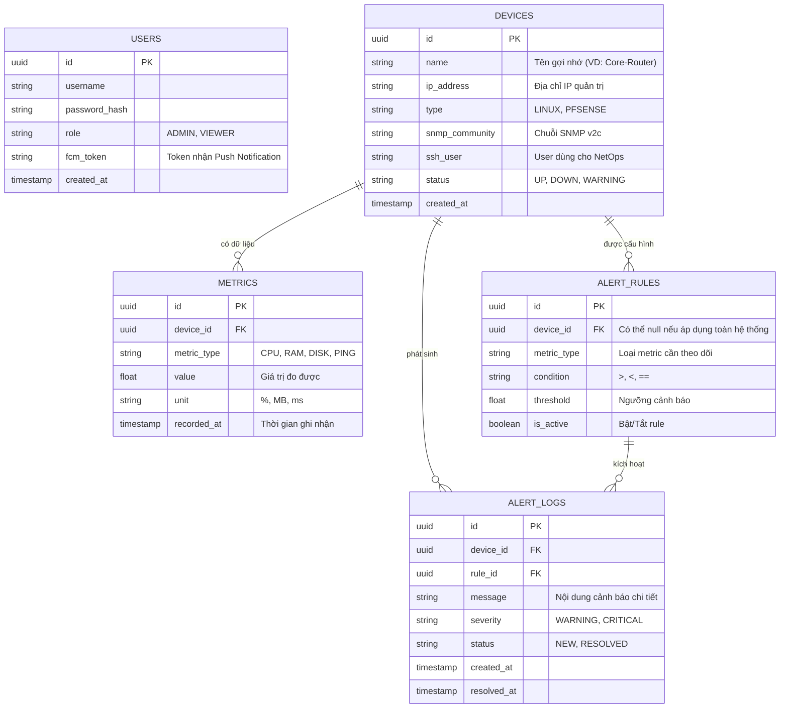

# Giai đoạn 2: Thiết kế Cơ sở dữ liệu (PostgreSQL)

Hệ thống giám sát hạ tầng mạng (NetOps Portal) yêu cầu một cơ sở dữ liệu có khả năng lưu trữ cấu hình thiết bị và xử lý tốt dữ liệu chuỗi thời gian (time-series) cho các thông số metric. Chúng ta sử dụng **PostgreSQL**.

## 1. Sơ đồ Thực thể Liên kết (ERD)

## 2. Giải thích chi tiết các Bảng (Tables)

### Bảng `USERS` (Quản trị viên)
- Lưu trữ thông tin đăng nhập của Admin hệ thống Web và Mobile.
- Field quan trọng: `fcm_token` dùng để Firebase gửi thông báo (Push Notification) thẳng đến điện thoại di động của User đó khi có sự cố.

### Bảng `DEVICES` (Thiết bị mạng/Máy chủ)
- Quản lý danh sách các Node cần giám sát (pfSense Firewall, Ubuntu Server...).
- Lưu trữ thông tin xác thực để Agent/Backend đi thu thập dữ liệu như `ip_address`, `snmp_community` (dành cho lấy metric), và `ssh_user` (dành cho việc gửi lệnh NetOps sửa lỗi).

### Bảng `METRICS` (Dữ liệu giám sát)
- Đây là bảng phình to nhanh nhất. Nó lưu trữ dữ liệu Time-series.
- Cứ mỗi 1-5 phút, hệ thống sẽ chèn (INSERT) hàng loạt bản ghi về CPU, RAM, Ping latency vào đây để Web Portal có thể vẽ biểu đồ (Chart).

### Bảng `ALERT_RULES` (Luật cảnh báo)
- Cho phép người dùng linh hoạt định nghĩa quy tắc.
- Ví dụ bản ghi: `device_id` = ID của pfSense, `metric_type` = CPU, `condition` = '>', `threshold` = 90. Ý nghĩa: Nếu CPU pfSense > 90% thì báo động.

### Bảng `ALERT_LOGS` (Lịch sử sự cố)
- Khi có một `METRICS` mới vượt quá `ALERT_RULES`, hệ thống tự sinh ra một record ở đây.
- Quản trị viên sau khi xử lý xong (qua Mobile App hoặc Web) thì bản ghi sẽ chuyển trạng thái `status` thành `RESOLVED`.
