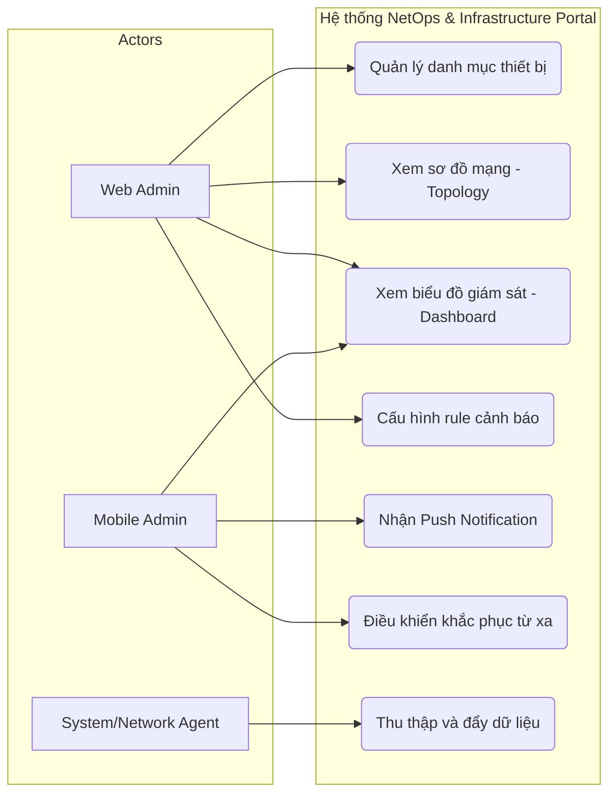
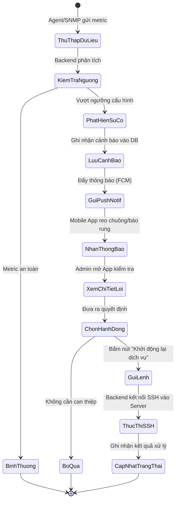
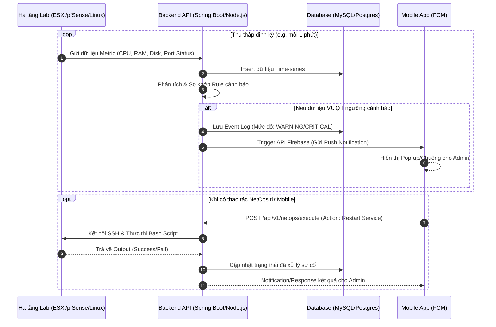

# Sơ đồ UML Hệ thống Giám sát & NetOps

Tài liệu này bao gồm các sơ đồ UML (Use Case, Activity, và Sequence) minh họa trực quan luồng hoạt động và tương tác giữa các thành phần trong hệ thống.

## 1. Sơ đồ Use Case (Tổng quát)
Sơ đồ mô tả các tác nhân (Actors) và những chức năng chính mà họ tương tác với hệ thống.

## 2. Sơ đồ Hoạt động (Activity Diagram) - Luồng xử lý sự cố khẩn cấp
Sơ đồ biểu diễn quá trình từ khi phát hiện một cảnh báo (ví dụ CPU quá tải hoặc rớt mạng) cho đến khi người quản trị dùng Mobile App để gửi lệnh khắc phục (NetOps).

## 3. Sơ đồ Tuần tự (Sequence Diagram) - Thu thập và Cảnh báo
Sơ đồ minh họa trình tự thời gian của các luồng dữ liệu (Data flow) giữa Server vật lý/ảo, Backend, Database và Mobile App.

